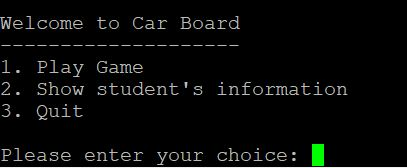
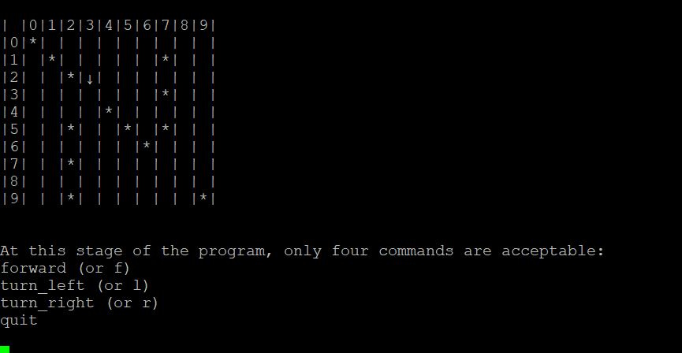

# C++ Board Game
### Description

C++ board game to demonstrate dynamic memory management and pointers.

### Key Features

- Input Validation
-	Player can move  “car” around the board.
-	Obstacles prevent car from moving.
-	All memory managed dynamically. 

